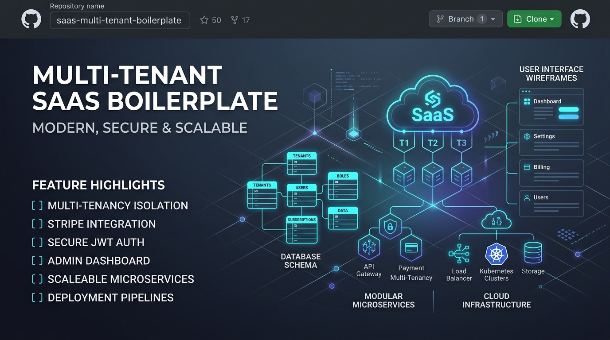

<p align="center">
  
</p>

# SaaS Boilerplate Multi-Tenant Monorepo

Enterprise-grade, scalable **Multi-Tenant SaaS Boilerplate** template designed for high performance, modularity, and rapid SaaS development.

---

## 🏗️ Monorepo Architecture (Turborepo + pnpm)

```text
boilerplate-saas-multi-tenant/
├── apps/
│   ├── api/                          # Laravel 11 (Central Backend API)
│   │   ├── app/
│   │   │   ├── Contracts/            # PaymentGatewayInterface, etc.
│   │   │   ├── DTOs/                 # Strict typed DTOs (PaymentCustomerDTO, etc.)
│   │   │   ├── Enums/                # PHP 8.1+ Backed Enums (TenantStatus, SubscriptionPlan)
│   │   │   ├── Http/Middleware/      # EnforceSubscriptionAccess (Read-Only 403 & Grace Warning)
│   │   │   ├── Models/               # Tenant (schema-isolated), User
│   │   │   └── Services/             # Domain final classes with static methods & Gateway Adapters
│   │   ├── config/                   # tenancy.php (PostgreSQLSchemaManager), subscription.php
│   │   ├── dev-contents/demo-requests/ # .http demo files (-demo.http)
│   │   └── routes/                   # public.php, tenant.php, admin.php, api.php
│   ├── site/                         # Nuxt 3 (Public Landing, Plans, Registration) [Port 3000]
│   ├── web/                          # Nuxt 3 (Tenant App, Auth, Dashboard, Billing) [Port 3001]
│   └── admin/                        # Nuxt 3 (Super Admin Console, Tenants, Moderation) [Port 3002]
├── packages/
│   ├── config/                       # Shared TypeScript & code quality configurations
│   └── ui/                           # Shared Vue 3 UI components with Iconify & useSubscription
├── backend -> apps/api               # Developer convenience symlink
├── pnpm-workspace.yaml               # pnpm workspace definition
├── turbo.json                        # Turborepo task pipeline
├── pint.json                         # Laravel Pint PSR-12 code style preset
└── .prettierrc                       # Prettier configuration
```

---

## 🚀 Quick Start

### Prerequisites
- **Node.js**: >= 20.x (pnpm >= 11.x)
- **PHP**: >= 8.3 (with `pdo_pgsql`, `redis`, `bcmath`, `mbstring`)
- **PostgreSQL**: >= 15.x
- **Redis**: >= 7.x
- **Composer**: >= 2.2

### 1. Install Workspace Dependencies
```bash
# Install root, front-end and package dependencies
pnpm install

# Install back-end dependencies
cd apps/api && composer install && cd ../..
```

### 2. Environment Configuration
```bash
cp apps/api/.env.example apps/api/.env
cd apps/api && php artisan key:generate && cd ../..
```

Configure `apps/api/.env` with your PostgreSQL, Redis, Mailpit, and S3 credentials.

### 3. Run Database Migrations
```bash
cd apps/api
php artisan migrate
cd ../..
```

### 4. Start Development Servers
```bash
# Start all front-end applications via Turborepo
pnpm dev

# Or start specific applications:
pnpm dev:site   # http://localhost:3000 (Public Site)
pnpm dev:web    # http://localhost:3001 (Tenant App)
pnpm dev:admin  # http://localhost:3002 (Super Admin)
pnpm dev:api    # http://localhost:8000 (Laravel API)
```

---

## 🔒 Code Standards & Architectural Guidelines

Every contribution strictly follows the project standards defined in [project-definition.md](project-definition.md) and [UNIVERSAL-CODE-STYLE-RULES.md](UNIVERSAL-CODE-STYLE-RULES.md):

1. **Back-end (PHP / Laravel 11):**
   - **Strict Typing:** `declare(strict_types=1);` on top of every PHP file with explicit types for all parameters and return values.
   - **PSR-12 Compliance:** Continuously validated and fixed via `apps/api/vendor/bin/pint`.
   - **Domain Services:** Declared as `final class` with static methods, wrapped in existence checks (`if (!class_exists(...))`).
   - **Control Flow:** Mandatory **Early Returns** and **Elseless** pattern (no `else` keyword). Maximum **1 level** of `if` nesting.
   - **Static References:** Always use `static::` instead of `self::`.
   - **Database & Enums:** PostgreSQL native `ENUM` is forbidden. Status columns use indexed `VARCHAR(50)` cast to native PHP 8.1+ Backed Enums. Native UTC timestamps everywhere.
   - **Multi-Tenancy:** PostgreSQL schema-level isolation powered by `stancl/tenancy` (`PostgreSQLSchemaManager`).
   - **Subscription & Read-Only Mode:**
     - Agnostic payment gateway adapter pattern (`PaymentGatewayInterface`, Stripe and Asaas adapters).
     - Access cycle determined strictly by `paid_until` timestamp and `trial_ends_at`.
     - Write requests (`POST`, `PUT`, `PATCH`, `DELETE`) on `/api/tenant` blocked with **HTTP 403** when expired.
     - Failed payments trigger a configurable grace period injecting the `X-Subscription-Warning` header.
   - **API Demonstrations:** Route changes must include corresponding `.http` request files in `backend/dev-contents/demo-requests/*-demo.http`.

2. **Front-end (Nuxt 3 / Vue 3):**
   - **Iconify Mandatory:** Exclusively use `iconify-icon` (e.g., `tabler:`, `fa7-solid:`, `mdi:`) with Tailwind CSS classes. No scattered SVG files or icon fonts.
   - **Reactive Subscription Interceptor:** Global HTTP interceptor reading `403` and `X-Subscription-Warning` to dynamically toggle read-only mode and display grace period warning banners via `useSubscription()`.
   - **Formatting:** Prettier with 4-space indentation enforced via `.prettierrc`.

---

## 🧪 Testing and Quality Checks

```bash
# Run PHP tests
pnpm test:php

# Validate PSR-12 code style
pnpm lint:php

# Format PHP codebase
pnpm format:php

# Format Front-end & Config
pnpm format

# Build all applications
pnpm build
```
